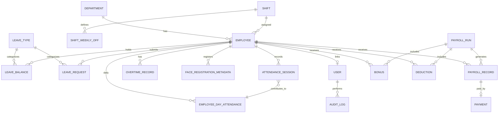

# Entity-Relationship Diagram

**Phase:** 2.1 — Design only  
**Status:** Preliminary  
**Last updated:** Phase 2.1

This document describes the logical ER model for PostgreSQL. It preserves all Phase 1 business rules and API boundaries.

---

## 1. Design Overview

The schema separates:

- **Identity & access** — `users` (login accounts) vs `employees` (workforce records)
- **Workforce structure** — departments, shifts, employees
- **Time tracking** — attendance sessions, daily attendance classification, leave, overtime
- **Compensation** — payroll runs, payroll records, bonuses, deductions, payments
- **Face metadata** — PostgreSQL registration status only; embeddings live in vector DB
- **Governance** — audit logs

Face embeddings are **not** stored in PostgreSQL.

---

## 2. High-Level ER Diagram (ASCII)

```
┌─────────────┐       ┌─────────────┐       ┌─────────────┐
│  department │       │    shift    │       │ leave_type  │
└──────┬──────┘       └──────┬──────┘       └──────┬──────┘
       │                     │                     │
       │    ┌────────────────┴────────────────┐    │
       │    │         shift_weekly_off        │    │
       │    └─────────────────────────────────┘    │
       │                     │                     │
       ▼                     ▼                     ▼
┌──────────────────────────────────┐    ┌─────────────────┐
│            employee              │    │  leave_balance  │
│  (department_id, shift_id,       │◄───┤ (employee, type)│
│   monthly_base_salary, status)   │    └─────────────────┘
└──────────┬───────────────────────┘              │
           │                                      │
    ┌──────┴──────┬──────────────┬────────────┐   │
    │             │              │            │   ▼
    ▼             ▼              ▼            ▼   ┌──────────────┐
┌────────┐  ┌───────────┐  ┌──────────┐  ┌──────────────┐
│  user  │  │face_reg   │  │attendance│  │leave_request │
│(optional│  │_metadata  │  │_session   │  └──────────────┘
│employee)│  └───────────┘  └────┬─────┘
└────────┘                       │
                                 ▼
                    ┌────────────────────────┐
                    │ employee_day_attendance│
                    │ (daily classification) │
                    └────────────────────────┘

┌─────────────┐     ┌──────────────┐     ┌─────────────┐
│ payroll_run │────►│payroll_record│────►│   payment   │
└──────┬──────┘     └──────┬───────┘     └─────────────┘
       │                   │
       │    ┌──────────────┼──────────────┐
       ▼    ▼              ▼              ▼
┌─────────────┐  ┌─────────────┐  ┌─────────────┐
│    bonus    │  │  deduction  │  │overtime_rec  │
└─────────────┘  └─────────────┘  └─────────────┘

┌─────────────┐     ┌─────────────────────┐
│ payroll_    │     │      audit_log      │
│ policy      │     │  (actor → user)     │
└─────────────┘     └─────────────────────┘
```

---

## 3. Vector DB Relationship (Cross-Store)

```
┌─────────────────────────┐         ┌─────────────────────────┐
│   PostgreSQL            │         │   Vector Database       │
│   employee              │         │   face_embedding        │
│   id (PK)               │◄────────│   employee_id (FK ref)  │
│   status, ...           │  1 : 1  │   embedding vector      │
│                         │  (MVP)  │   model metadata        │
│   face_registration_    │         │   status, created_at    │
│   metadata              │         └─────────────────────────┘
│   vector_record_id      │──────────────────► links to vector
│   registration_status   │                    record identity
└─────────────────────────┘
```

The backend validates `employee.id` exists and `status = ACTIVE` before using a vector search result for attendance.

---

## 4. Core Relationships

| From | To | Cardinality | Description |
|------|-----|-------------|-------------|
| `department` | `employee` | 1 : N | Each employee belongs to one department |
| `shift` | `employee` | 1 : N | Each employee has one primary shift |
| `shift` | `shift_weekly_off` | 1 : N | Weekly-off days per shift |
| `employee` | `user` | 1 : 0..1 | At most one user per employee; enforced by `UNIQUE (employee_id)` on `user` (nullable for `ADMIN` accounts with no employee link) |
| `employee` | `attendance_session` | 1 : N | Sessions per employee |
| `employee` | `employee_day_attendance` | 1 : N | One row per employee per calendar date (working-day evaluation) |
| `attendance_session` | `employee_day_attendance` | N : 1 | Sessions contribute to daily classification |
| `employee` | `leave_balance` | 1 : N | Balance per leave type |
| `leave_type` | `leave_balance` | 1 : N | Type defines balance bucket |
| `employee` | `leave_request` | 1 : N | Leave requests |
| `leave_type` | `leave_request` | 1 : N | Request references type |
| `employee` | `overtime_record` | 1 : N | Overtime per work date |
| `payroll_run` | `payroll_record` | 1 : N | One record per employee per run |
| `employee` | `payroll_record` | 1 : N | Employee payroll history |
| `payroll_record` | `payment` | 1 : 0..1 | Payment against finalized record (MVP: one payment) |
| `employee` | `bonus` | 1 : N | Bonuses for periods; `payroll_run_id` NULL until included in a run |
| `employee` | `deduction` | 1 : N | Deductions for periods; `payroll_run_id` NULL until included in a run |
| `payroll_run` | `bonus` | 1 : N | Assigned when bonus is included in payroll run |
| `payroll_run` | `deduction` | 1 : N | Assigned when deduction is included in payroll run |
| `user` | `audit_log` | 1 : N | Actor for audit entries |
| `employee` | `face_registration_metadata` | 1 : N | Registration history in PostgreSQL; only one `ACTIVE` per employee (MVP) |

---

## 5. Mermaid ER Diagram



---

## 6. Entity Existence Rationale

| Entity | Why it exists |
|--------|----------------|
| `department` | BR-EMP-01, DEPT requirements — organizational grouping |
| `shift` | BR-SHIFT-01, SHIFT requirements — schedule basis for lateness, overtime, weekly-off |
| `shift_weekly_off` | BR-SHIFT-03, BR-ATT-24 — normalized weekly-off config (not hardcoded Sunday) |
| `employee` | Core workforce identity; links department, shift, salary |
| `user` | AUTH requirements — login separate from employee (admin without employee record) |
| `face_registration_metadata` | FACE-REG-04, API `face_registered` — PostgreSQL registration history and vector record reference; embeddings remain in vector DB |
| `attendance_session` | BR-ATT-05–12 — check-in/check-out session state machine |
| `employee_day_attendance` | BR-ATT-13–22, payroll — daily FULL-DAY/HALF-DAY/ABSENT/LEAVE classification per date |
| `leave_type` | BR-LEAVE-06 — configurable leave categories |
| `leave_balance` | BR-LEAVE-04, LEAVE-04 — per-type balance tracking |
| `leave_request` | BR-LEAVE-01–03 — approval workflow |
| `overtime_record` | BR-OT-01–08 — separate overtime storage with approval status |
| `payroll_policy` | BR-PAY-05–06 — configurable working-day divisor (not hardcoded 30) |
| `payroll_run` | BR-PAY-02, PAY-01 — monthly run per period, idempotent protection |
| `payroll_record` | BR-PAY-15 — per-employee payroll outcome for a run |
| `bonus` | BR-BONUS-01 — auditable bonus entries |
| `deduction` | BR-DED-01 — auditable deduction entries |
| `payment` | BR-PMT-01–02, PMT-01 — payment recording against finalized payroll |
| `audit_log` | BR-AUDIT-01–05, AUDIT requirements |

**Not separate entities:**

- **Payroll line items** — amounts stored on `payroll_record` with optional breakdown columns; bonuses/deductions remain separate source tables for audit
- **Tax** — excluded from MVP (BR-PAY-14)
- **Face embedding** — vector DB only

---

## 7. Related Documents

- [relational-schema.md](./relational-schema.md) — attribute-level detail
- [database-constraints.md](./database-constraints.md) — PK, FK, constraints
- [normalization.md](./normalization.md) — 3NF analysis
- [../face/vector-db-design.md](../face/vector-db-design.md) — vector store model
- [../phase2/decisions.md](../phase2/decisions.md) — Phase 2 decisions
